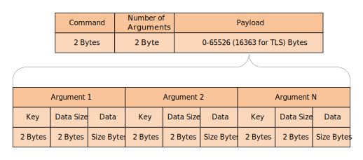

# Host Communication Protocol (HCP)

Welcome to the documentation for the Host Communication Protocol (HCP).

The first part covers the physical method of sending messages and the second part covers the
specification of the different command flows.

## FPC embedded stack and HCP

The communication stack implemented on the embedded devices by FPC follows the following specification.

**HCP embedded stack**

 #### Physical

The physical layer have a fixed size buffer of 256 bytes.

#### Link

The link layer handles packet consistency.

Each packet received is acknowledged on the link layer, if an error occurs no retransmission is done on this level, instead the error is propagated upwards.

| Channel |	Size  | Payload | CRC |
| :------: | :------: | :------: | :------:|
| 2 bytes |	2 bytes |	size bytes |	4 bytes

All fields are using unsigned data types.

#### Transport

The transport layer handles packet segmentation.

As the PHY MTU is 256 bytes the maximum payload per segment is 242 bytes.

Errors are propagated upwards.

|Size 	| Seq Nr |	Seq Len | Payload |
| :------: | :------: | :------: | :------:|
|2 bytes |	2 bytes |	2 bytes  | size bytes|

All fields are using unsigned data types.

#### Application

The application layer is a optional security layer, the default implementation is clear text (unsecure).

If a security solution is used it will be part of that products documentation.

## HCP frame format 

#### Command

The Commands define the general action that is going to be executed. However, each command can have several Arguments each with data attached.

| CMD | Num Args | Payload |
| :------: | :------: | :------: |
| 2 bytes | 2 bytes | xx bytes |

All fields are using unsigned data types.

#### Argument

The Argument is used as a complement to the command if it is needed and can contain arbitrary data.

| ARG |	Size |	Data |
| :------: | :------: | :------: |
| 2 bytes | 2 bytes | size bytes |

All fields are using unsigned data types.

